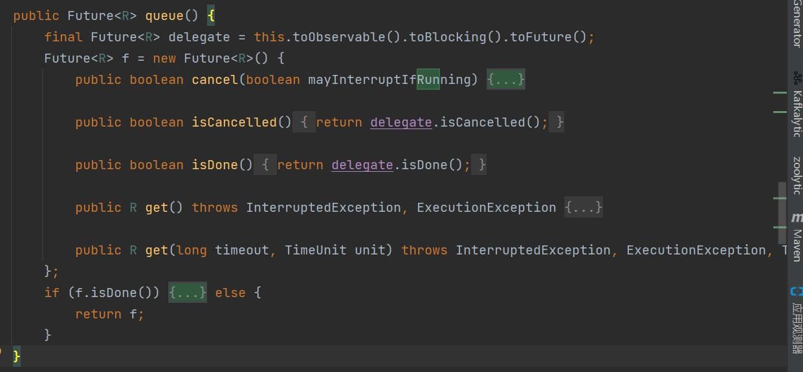

# hystric源码系列

```java
package com.example.demo.hystrix;

import com.netflix.hystrix.HystrixCommand;
import com.netflix.hystrix.HystrixCommandGroupKey;
import com.netflix.hystrix.HystrixCommandKey;
import com.netflix.hystrix.HystrixCommandProperties;

public class GroupTestService extends HystrixCommand<String> {
    private static final HystrixCommand.Setter cacheSetter = HystrixCommand.Setter.
            withGroupKey(HystrixCommandGroupKey.Factory.asKey("ExampleGroup")).
            andCommandKey(HystrixCommandKey.Factory.asKey("Group")).
            andCommandPropertiesDefaults(HystrixCommandProperties.Setter().withExecutionTimeoutInMilliseconds(3000));

    public GroupTestService(String name) {
        super(cacheSetter);
        this.name = name;
    }

    String name;

    @Override
    protected String run() throws Exception {
        Thread.sleep(2000);
        return "group-" + name;
    }
    @Override
    protected String getFallback() {
        return "group-error-" + name;
    }
}
```

一个Hystric的demo。


## HystrixCommand

```java
public abstract class HystrixCommand<R> extends AbstractCommand<R> implements HystrixExecutable<R>, HystrixInvokableInfo<R>, HystrixObservable<R> {
    private final AtomicReference<Thread> executionThread;
    private final AtomicBoolean interruptOnFutureCancel;
    protected HystrixCommand(HystrixCommand.Setter setter) {
        this(setter.groupKey, setter.commandKey, setter.threadPoolKey, (HystrixCircuitBreaker)null, (HystrixThreadPool)null, setter.commandPropertiesDefaults, setter.threadPoolPropertiesDefaults, (HystrixCommandMetrics)null, (TryableSemaphore)null, (TryableSemaphore)null, (HystrixPropertiesStrategy)null, (HystrixCommandExecutionHook)null);
    }
```


**execute和queue**

````java
   public R execute() {
        try {
            return this.queue().get();
        } catch (Exception var2) {
            throw Exceptions.sneakyThrow(this.decomposeException(var2));
        }
    }

    public Future<R> queue() {
        final Future<R> delegate = this.toObservable().toBlocking().toFuture();
        Future<R> f = new Future<R>() {
            ...
                }
            }
````

execute实际上在调用queue的get，也就是future的get。

重写了Future结构太长了放一下整体的代码结构。




### toFuture

queue的第一行中最后一个函数。

做的事情很简单，一个countDownLatch，记录subscribe完成没，而subscribe只有全部完成或者出错的时候，才会完成结束。而finished，在future中进行条件阻塞，当出问题或者完成就自动返回咯。有问题返回错误，没问题返回value。

```java
public final class BlockingOperatorToFuture {
    private BlockingOperatorToFuture() {
        throw new IllegalStateException("No instances!");
    }

    public static <T> Future<T> toFuture(Observable<? extends T> that) {
        final CountDownLatch finished = new CountDownLatch(1);
        final AtomicReference<T> value = new AtomicReference();
        final AtomicReference<Throwable> error = new AtomicReference();
        final Subscription s = that.single().subscribe(new Subscriber<T>() {
            public void onCompleted() {
                finished.countDown();
            }

            public void onError(Throwable e) {
                error.compareAndSet((Object)null, e);
                finished.countDown();
            }

            public void onNext(T v) {
                value.set(v);
            }
        });
        return new Future<T>() {
            private volatile boolean cancelled;

            public boolean cancel(boolean mayInterruptIfRunning) {
                if (finished.getCount() > 0L) {
                    this.cancelled = true;
                    s.unsubscribe();
                    finished.countDown();
                    return true;
                } else {
                    return false;
                }
            }

            public boolean isCancelled() {
                return this.cancelled;
            }

            public boolean isDone() {
                return finished.getCount() == 0L;
            }

            public T get() throws InterruptedException, ExecutionException {
                finished.await();
                return this.getValue();
            }

            public T get(long timeout, TimeUnit unit) throws InterruptedException, ExecutionException, TimeoutException {
                if (finished.await(timeout, unit)) {
                    return this.getValue();
                } else {
                    throw new TimeoutException("Timed out after " + unit.toMillis(timeout) + "ms waiting for underlying Observable.");
                }
            }

            private T getValue() throws ExecutionException {
                Throwable throwable = (Throwable)error.get();
                if (throwable != null) {
                    throw new ExecutionException("Observable onError", throwable);
                } else if (this.cancelled) {
                    throw new CancellationException("Subscription unsubscribed");
                } else {
                    return value.get();
                }
            }
        };
    }
}

```
### toBlocking

从Observable转化到BlockingObservable

```java
public final BlockingObservable<T> toBlocking() {
    return BlockingObservable.from(this);
}
```

而from返回的就是一个BlockingObservable，调用私有构造函数生成的对象。

```Java
public final class BlockingObservable<T> {
    private final Observable<? extends T> o;
    static final Object ON_START = new Object();
    static final Object SET_PRODUCER = new Object();
    static final Object UNSUBSCRIBE = new Object();

    private BlockingObservable(Observable<? extends T> o) {
        this.o = o;
    }

    public static <T> BlockingObservable<T> from(Observable<? extends T> o) {
        return new BlockingObservable(o);
    }
```

而toFuture中最后调用的函数是 that.single().subscribe

而future中用的subscibe如下

```
    public final Subscription subscribe(Subscriber<? super T> subscriber) {
        return subscribe(subscriber, this);
    }
```


### subscribe

subsciber是个策略模式，然后回调用到下一个函数，里面的内容就没了。

```java
public final Subscription subscribe(Subscriber<? super T> subscriber) {
    return subscribe(subscriber, this);
}

static <T> Subscription subscribe(Subscriber<? super T> subscriber, Observable<T> observable) {
    if (subscriber == null) {
        throw new IllegalArgumentException("subscriber can not be null");
    } else if (observable.onSubscribe == null) {
        throw new IllegalStateException("onSubscribe function can not be null.");
    } else {
        ((Subscriber)subscriber).onStart();
        if (!(subscriber instanceof SafeSubscriber)) {
            subscriber = new SafeSubscriber((Subscriber)subscriber);
        }

        try {
            RxJavaHooks.onObservableStart(observable, observable.onSubscribe).call(subscriber);
            return RxJavaHooks.onObservableReturn((Subscription)subscriber);
        } catch (Throwable var6) {
            Throwable e = var6;
            Exceptions.throwIfFatal(var6);
            if (((Subscriber)subscriber).isUnsubscribed()) {
                RxJavaHooks.onError(RxJavaHooks.onObservableError(var6));
            } else {
                try {
                    ((Subscriber)subscriber).onError(RxJavaHooks.onObservableError(e));
                } catch (Throwable var5) {
                    Exceptions.throwIfFatal(var5);
                    RuntimeException r = new OnErrorFailedException("Error occurred attempting to subscribe [" + var6.getMessage() + "] and then again while trying to pass to onError.", var5);
                    RxJavaHooks.onObservableError(r);
                    throw r;
                }
            }

            return Subscriptions.unsubscribed();
        }
    }
}
```

toFuture中所需要实现的三个函数都是Observer的，就这说明的通了。

Obeserver观察者，observable可观察的。

subscribe==>观察者观察可被观察的。

既然是观察者，那么根据观察者模式来说，被将观察者注册到自己的内容中去，那么根据Observer的函数来说，那就是完成一次观察后，调用一个onNext，完成所有的观察后调用onCompleted。

凌晨1：30.整理下睡咯。

```Java
public interface Observer<T> {
    void onCompleted();

    void onError(Throwable var1);

    void onNext(T var1);
}
public class Observable<T> {
    final Observable.OnSubscribe<T> onSubscribe;
}
```
