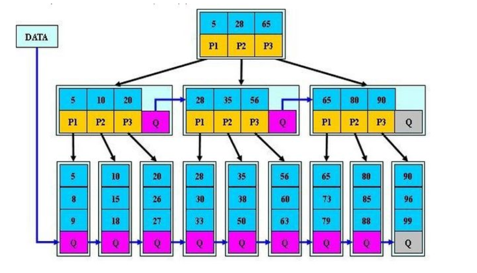

> 前言 代码本科写的，所以使用的是C++。

## Tree

最近开始学习了树，借鉴了大量的同学的博客，再次把借鉴最多的同学的博客地址发在这里
[wsx的tree](https://fightinggg.github.io/tree/)真的强。

### BST(二叉搜索树)
这个树的思想很简单，大的节点往右边走，小的节点往左边走，是不需要维护的，只需要把数据进行比较往上面加就行了，不过这样还是有很多的问题，比如一个有序的序列就会变成一个链表了，那样的查找效率还是很低，所以这个树的查找是不稳定的，和树的高度有关系。
#### insert
递归的进行比较，小于往左边走，大于往右边走，然后到达一个空值，说明到达了叶节点，进行创建。
#### erase
这个也是递归的进行，小的左边，大的右边，如果等于的时候，我得处理是找到次小值，然后替换这个点的值，删除次小值所在的节点。如何查找次小值，只需要往右边走一步，然后左边走到底。
#### search
这个过程和查找很想，如果访问到了空值，这个时候的操作不是添加，而是返回没找到。


### AVL(平衡二叉树)
平衡二叉树和二叉树相比多了一个自平衡的操作，这样的好处是能稳定树的高度，避免成为链表这种极端情况出现。平衡的操作是通过一个高度来完成，一个树的左右节点的高度要小于2，才是平衡的如果超过2那就需要进行一次维护了。这里分4中情况，左旋转，右旋转，左右旋，右左旋。


这是维基百科的图，这里已经写得很清楚了。我还是解释下，这里的右旋，左左左的情况下，B节点是第二大的，所以平衡就需要把B的右节点设置为A。这就吧A的节点转移到B，把A储存起来，然后将A节点的左边删除，放在B的右边。左右的情况，只需要把他先转化成左左左就行了。
#### insert
这里插入和bst相似，不过在之后有一个维护的过程，因为是递归进行的，所以递归的回去的时候，可以检查高度的值是否符合，如果不符合就进行调整。
#### erase
这里删除也是和bst相似，也是找到次大的那个叶节点，然后交换值，删除叶节点，从叶节点进行上诉的维护。

### B树-
这个和之前不同的是，他可以有很多的子节点。
#### 约束：
    1.键值不能小于[N/2]-1,大于[N-1].
    2.子树的数目是键值减一
    3.所有叶子节点在同一高度
    4.根节点的数目是[2,N-1]
#### insert
b树的插入和之前的相似，也是先比较键值，然后选择一个进入的儿子，直到到了叶子节点，进行插入，然后进行检查是否满足约束，不满足就进行分裂，然后递归返回进行检查约束。
#### erase
b树的删除，和之前的想法类似，想办法把要删除的值替换到叶子节点，找到次大的节点，进行交换。然后从次大的节点进行删除，进行维护。如果该叶子的数目违反了约束就看看兄弟叶子是否删除一个后是否违反约定，如果没有违反，就从兄弟借一个到k父亲keys替换掉，吧父亲的key放在此叶子节点。如果二者相加小于N-2那么就直接拿到父亲节点的那个键，和2个儿子一起组成一个节点。

### B+树
B+树和B树-很相似，只不过B+树不在储存键值了，而是一个索引的功能，这样所有的键值全部在叶子节点上了，
#### 规则
    1.B+树不在进行储存键的值了，而是进行索引，那么键数目和子节点一样。
    2.B+树所有的键值全部放在叶子节点上
    3.B+树会把下一个节点的开始储存在叶子节点尾部。

### B*树
B*树和B+树又很想，不过这个他们还是有点区别的。
B*树是$\frac{2}{3}$的利用，而B+,B都是$\frac{1}{2}$的利用。具体是，他会检查兄弟是不是满的，如果未满，就把节点往兄弟转移关键字。如果兄弟满了那就把兄弟和自己拿出$\frac{1}{3}$合并成一个新的节点。这个其实我想还是有些难度的，我没有实现，要实现做起来估计很累，嘤嘤嘤。他也储存了兄弟节点这就很好的访问兄弟节点了。


## 树
### 树的遍历
树得遍历分为4种，前序遍历，中序遍历，后续遍历和层次遍历。
```
前序遍历：根结点 ---> 左子树 ---> 右子树

中序遍历：左子树---> 根结点 ---> 右子树

后序遍历：左子树 ---> 右子树 ---> 根结点

层次遍历：只需按层次遍历即可
```
